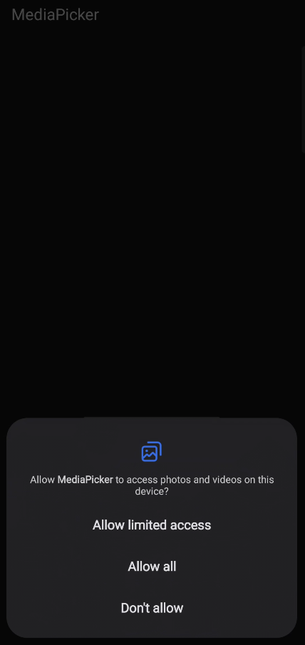
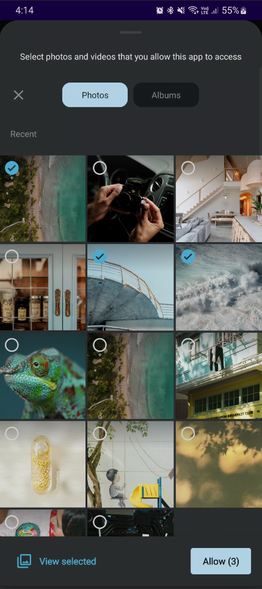
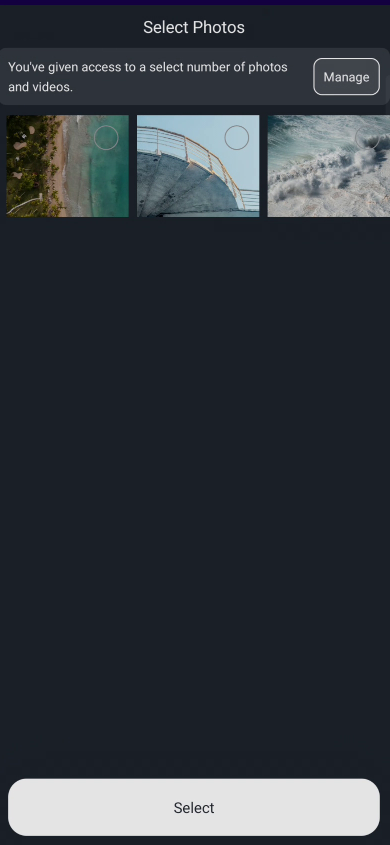

# Mediapicker Module for Android

<div style="display: flex; justify-content: space-between;">





</div>

### Installation

To integrate the **Mediapicker** module into your Android project, follow these steps:

1. **Add the dependency** to your project’s `build.gradle` file (module level):

   ```gradle
   dependencies {
       implementation 'com.github.Nishith4545:MediaPicker:1.0.8'
   }
   
The **Mediapicker Module** is a Kotlin-based Android library designed to simplify media selection in your apps. It automatically handles permissions related to media access and eliminates the need to manually declare them in your app's `AndroidManifest.xml`. Additionally, it supports **Android 14's Limited Access** feature, allowing users to grant access to specific photos and videos instead of all media files on their device.

## Features

### 1. **Automatic Permission Handling**
   - **Mediapicker Module** automatically manages runtime permissions for accessing photos and videos.
   - No need to manually declare permissions in your app's `AndroidManifest.xml`. The module handles everything internally.
   - Permissions are requested at runtime only when required, ensuring better security and compliance with Android's privacy policies.

### 2. **Support for Android 14's Limited Access Feature**
   - Fully supports **Android 14 (API level 34)** and its new **Limited Access to Photos and Videos** feature.
   - Users can select specific photos or videos to share with your app, providing better privacy controls.
   - The module ensures seamless handling of these restricted permissions on Android 14 and above, with no additional setup required from the developer.

3. **Usage**
   - The Mediapicker module provides an easy-to-use API to launch media selection and handle results, including permissions and access.

### In Your Fragment or Activity

To use the **Mediapicker Module**, you need to declare the `MediaSelectHelper` and configure it according to your media selection requirements.

#### Step 1: Initialize the Helper

```kotlin
lateinit var mediaSelectHelper: MediaSelectHelper
override fun onCreate(savedInstanceState: Bundle?) {
        super.onCreate(savedInstanceState)
        mediaSelectHelper = MediaSelectHelper(this)
}
```

#### Step 2: Set Media Selection Options
For selecting images:
```kotlin
mediaSelectHelper.canSelectMultipleImages(false) // Set whether multiple images can be selected
mediaSelectHelper.selectOptionsForImagePicker(true) // Enable image picker options
```
For selecting videos:
```kotlin
mediaSelectHelper.canSelectMultipleVideo(false) // Set whether multiple videos can be selected
mediaSelectHelper.selectOptionsForVideoPicker() // Enable video picker options
```

#### Step 3(Optional): Customize Limited Access Screen
Use the callback function to retrieve selected media (image/video):
```kotlin
mediaSelectHelper.setLimitedAccessLayoutBackgroundColor(R.color.teal_200)
```

#### Step 4: Register Callbacks to Handle Selected Media
To change the background color of the limited access media screen:
```kotlin
private fun setImagePicker() = with(binding) {
    mediaSelectHelper.registerCallback(object : MediaSelector {
        override fun onVideoUri(uri: Uri) {
            super.onVideoUri(uri)
            getPath(this@MainActivity, uri)?.let { it1 ->
                imageView.loadImagefromServerAny(it1)
            }
        }

        override fun onImageUri(uri: Uri) {
            uri.path?.let {
                imageView.loadImagefromServerAny(it)
            }
        }

        override fun onCameraVideoUri(uri: Uri) {
            uri.path?.let {
                imageView.loadImagefromServerAny(it)
            }
        }

        override fun onUpdatedStorageMedia(
            storageAccess: String,
            canSelectMultipleImages: Boolean,
            canSelectMultipleVideos: Boolean,
            selectFilter: String,
            mediaPath: String
        ) {
            super.onUpdatedStorageMedia(
                storageAccess,
                canSelectMultipleImages,
                canSelectMultipleVideos,
                selectFilter,
                mediaPath
            )
            imageView.loadImagefromServerAny(mediaPath)
        }
    }, supportFragmentManager)
}
```
